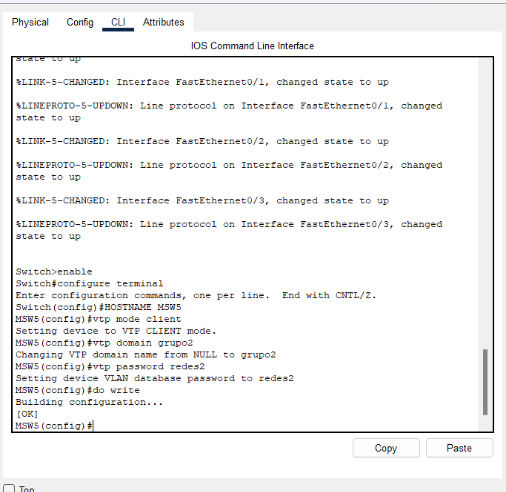

# MANUAL TECNICO | PROYECTO 1  
## Topología implementada  


## Configuración de Ip   
| Red          | Vlan    | 
| ------------ | ------------ |
|Interfaces de VLAN | 192.168.22.1 | 
|VLAN_Verde_Grupo_22 | 192.168.22.65 |
|VLAN_Naranja_Grupo_22 | 192.168.22.129 |
| VLAN_Verde_Grupo_22 | 192.168.22.193 |

# Topología implementada  
Se utilizó la herramienta Packet Tracer para la implementación de la topología solicitada, constando de 8 switches 3560, 4 switches 3650 y 4 switches 2960 de capa 2, utilizando 4 PC-PT y 4 Laptop-PT, cada switch configurado con sus respectivos puertos truncales y de acceso como se detallará más adelante:

Para la conexión de switches 3650 con cable de fibra óptica, se realizó la configuración de agregar puertos y un módulo de fuente de poder a los 4 switches centrales de la topología:


## Configuración VLAN  
```
Switch>
Switch>enable
Switch#conf t
Enter configuration commands, one per line.  End with CNTL/Z.
Switch(config)#interface vlan 14
Switch(config-if)#
%LINK-5-CHANGED: Interface Vlan14, changed state to up

%LINEPROTO-5-UPDOWN: Line protocol on Interface Vlan14, changed state to up

Switch(config-if)#ip address 192.168.22.1 255.255.255.192
Switch(config-if)#no shutdown
Switch(config-if)#do wr
Building configuration...
[OK]
Switch(config-if)#exit
Switch(config)#interface vlan 24
Switch(config-if)#
%LINK-5-CHANGED: Interface Vlan24, changed state to up

%LINEPROTO-5-UPDOWN: Line protocol on Interface Vlan24, changed state to up

Switch(config-if)#ip address 192.168.22.65 255.255.255.192
Switch(config-if)#no shutdown
Switch(config-if)#do wr
Building configuration...
[OK]
Switch(config-if)#exit
Switch(config)#interface vlan 14
Switch(config-if)#ip helper-address 90.0.0.2
Switch(config-if)#do wr
Building configuration...
[OK]
Switch(config-if)#exit
	
Switch(config)#interface vlan 24
Switch(config-if)#ip helper-address 90.0.0.2
Switch(config-if)#do wr
Building configuration...
[OK]
Switch(config-if)#exit
```


## Ip Helper  
Se realizó la configuración del comando Ip Helper Address en todos los switches multicapa que tuvieran interfaces VLAN, comando que permite que los dispositivos pertenecientes a una subred puedan solicitar una dirección IP a un servidor DHCP dependiendo de la subred a la que pertenezcan, por lo que se muestra un ejemplo de la configuración realizada:

```
Switch(config-if)#ip address 192.168.22.65 255.255.255.192
Switch(config-if)#no shutdown
Switch(config-if)#do wr
Building configuration...
[OK]
Switch(config-if)#exit
Switch(config)#interface vlan 14
Switch(config-if)#ip helper-address 90.0.0.2
Switch(config-if)#do wr
Building configuration...
[OK]
Switch(config-if)#exit
Switch(config)#interface 24
                         ^
% Invalid input detected at '^' marker.
	
Switch(config)#interface vlan 24
Switch(config-if)#ip helper-address 90.0.0.2
Switch(config-if)#do wr
Building configuration...
[OK]
Switch(config-if)#exit
```
# VTP  

Se realizó la configuración del protocolo VTP, donde se determinó que el switch server sería el MSW4, ingresando sus respectivos comandos de la siguiente manera:  
  
Por lo que en consecuencia, se procedió a la configuración de todos los demás switches de la topología, siendo estos los clientes del mismo protocolo como se muestra a continuación:  
  

## OSPF  

El OSPF es un protocolo de enrutamiento dinámico que se utiliza para enrutar paquetes dentro de una red de computadoras, por lo que se procede a configurar el mismo sobre los  switches capa 3 de la topología, como se muestra a continuación:  
```
router ospf 22
 router-id 1.1.1.1
 log-adjacency-changes
 network 192.168.50.0 0.0.0.255 area 22
 network 192.168.60.0 0.0.0.255 area 22
 network 192.168.70.0 0.0.0.255 area 22
 network 192.168.34.0 0.0.0.255 area 22
 network 192.168.44.0 0.0.0.255 area 22


router ospf 22
 router-id 1.1.1.1
 log-adjacency-changes
 network 192.168.70.0 0.0.0.255 area 22
 network 192.168.74.0 0.0.0.255 area 22
 network 192.168.84.0 0.0.0.255 area 22
```


## HSRP  

```
Switch>enable
Switch#conf t
Enter configuration commands, one per line.  End with CNTL/Z.
Switch(config)#interface vlan 14
Switch(config-if)#
%LINK-5-CHANGED: Interface Vlan14, changed state to up

Switch(config-if)#ip address 192.168.22.2 255.255.255.192
Switch(config-if)#standby 1 ip 192.168.22.1
Switch(config-if)#standby 1 priority 90
Switch(config-if)#standby 1 preempt
Switch(config-if)#do wr
Building configuration...
[OK]
Switch(config-if)#exit
Switch(config)#interface 24
                         ^
% Invalid input detected at '^' marker.
	
Switch(config)#interface vlan 24
Switch(config-if)#
%LINK-5-CHANGED: Interface Vlan24, changed state to up

Switch(config-if)#ip address 192.168.22.66 255.255.255.192
Switch(config-if)#standby 1 ip 192.168.22.65
Switch(config-if)#standby 1 priority 90
Switch(config-if)#standby 1 preempt
Switch(config-if)#do wr
Building configuration...
[OK]
Switch(config-if)#exit
Switch(config)#
```


## DHCP  
Se realizó la configuración del protocolo DHCP en los 2 switches DHCP1 y DHCP2, donde se les ingresó las ip de forma estática, en conjunto con su respectivo gateway, DNS:  


Añadiendo la red respectiva de cada VLAN, para poder asignar la ip de forma dinámica en cada servidor de la siguiente manera:  


## Servidor Web  
Para visualizar dicha página, se debe ingresar al desktop del servidor web, ingresar a la opción navegador web y en la barra de direcciones colocar la dirección del mismo  
